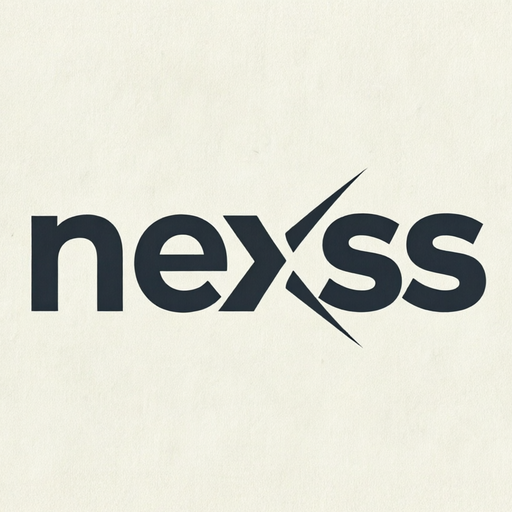

# Nexss Flow editor support



Editor support for the **Nexss Flow** language built around `nexssp/kernel` and the Nexss Flow Arrow DSL. The repository is intentionally editor-only: it does not attempt to parse or execute Flow. It provides a shared syntax vocabulary for:

- **Zed** through a Tree-sitter grammar and `highlights.scm`.
- **VS Code and compatible editors** through a TextMate grammar.
- **Notepad++** through a User Defined Language XML profile.
- **Completion snippets** for common pipelines, projections, directives, loops, and node modifiers.
- **LSP stubs** for VS Code/Zed integration, exposing initialize, hover, and structural completion responses.
- **`flowfmt` autoformatting** through the CLI, LSP, VS Code, and a best-effort Notepad++ NppExec wrapper.

The syntax is designed to be forgiving while a flow is being edited. Unknown action names remain highlighted as nodes, so newly registered kernel actions appear automatically without changing the grammar.

## Install

### Zed

Copy `zed/` into a local Zed extension directory or use it as the basis of a published Zed extension. The grammar is included as `zed/grammars/flow.wasm` only after compiling the Tree-sitter grammar; the repository source is `zed/grammars/flow.js` and can be compiled with the Tree-sitter CLI.

```bash
npx tree-sitter generate zed/grammars/flow.js
npx tree-sitter build --wasm zed/grammars/flow.js -o zed/grammars/flow.wasm
```

For a quick local test of the highlight queries, inspect `zed/grammars/flow.js` and `zed/languages/flow/highlights.scm` together.

### VS Code

Copy `vscode/` into an extension project, or copy `vscode/syntaxes/flow.tmLanguage.json` into an existing TextMate grammar extension. Associate it with `*.flow`.

A minimal `package.json` contribution is shown in `vscode/package.json`.

The completion file is `vscode/snippets/flow.code-snippets`. The dependency-free LSP stub is at `lsp/flow-language-server.js`; the VS Code extension host in `vscode/extension.js` launches the embedded copy and forwards completion requests over stdio using JSON-RPC. It is intentionally ready to be replaced with registry-aware kernel introspection.

### Notepad++

Import `notepadpp/flow-udl.xml` using **Language > Define your language > Import**. Associate `.flow` files manually if Notepad++ does not do so automatically.

### Zed snippets and LSP

Zed snippets are in `.zed/snippets/nexss-flow.json`; this is the repository/project-local snippet location and may need to be copied into a user Zed snippets directory for a published extension. The Zed language configuration registers `nexss-flow-language-server`; the executable wrapper is `zed/lsp/nexss-flow-language-server`, and the packaged Zed archive includes both the wrapper and its embedded server. The companion metadata in `zed/language-servers/` documents the local command used by an extension host.

## CI/CD and releases

`.github/workflows/release.yml` validates every pull request, builds the VS Code VSIX, creates ZIP artifacts for the source/Zed/Notepad++ integrations, and publishes tagged GitHub releases for tags matching `vX.Y.Z`. The same workflow includes an **opt-in** marketplace job: set the repository variable `PUBLISH_MARKETPLACES=true` and configure `VSCE_PAT` plus the Zed marketplace credential before enabling publication. Credentials are never stored in the repository, and marketplace publishing is not attempted by default.

To reproduce packaging locally:

```bash
bash scripts/package-release.sh dist
```

The output directory contains `nexss-flow-vscode.vsix`, `nexss-flow-zed.zip`, `nexss-flow-notepadpp.zip`, `nexss-flow-source.zip`, and `SHA256SUMS`.

The supplied Nexss logo is included in the source bundle and adapted for each editor: VS Code uses `vscode/icon.png` in its extension manifest, while the Zed and Notepad++ bundles include `logo.png`/`nexss-logo.png` for repository, package, and documentation branding. Zed's official publishing flow does not currently use an extension-manifest icon field, so its logo is shipped as an asset rather than added as unsupported TOML.

Two separate Zed packages are produced. Use `nexss-flow-zed.zip` for current Zed versions and `nexss-flow-zed-legacy-0.230.2.zip` for Zed 0.230.2. Both manifests use the working `schema_version = 1` format and declare the `process:exec` capability; they remain separate so future Zed-specific changes cannot break the older package. For **Install Dev Extension**, select the extracted folder containing `extension.toml` directly.

To create a GitHub release, push a version tag whose commit already contains `.github/workflows/release.yml`:

```bash
git tag -a v0.1.0 -m "Release v0.1.0"
git push origin v0.1.0
```

The workflow validates and packages every pushed `v*` tag, then creates the GitHub release. Marketplace publishing is deliberately deferred; no marketplace accounts, variables, or secrets are required for the current release process.

## Formatting

The repository includes a conservative, dependency-free `flowfmt` implementation. It normalizes operator spacing, indentation, blank lines, line endings, and UTF-8 BOM handling without changing strings or modifier ordering. It is intentionally a syntax formatter rather than a semantic validator; malformed Flow should be rejected by the canonical Flow compiler.

The canonical Tree-sitter source is `grammar.js` at the repository root. It now generates successfully with `npx --yes tree-sitter-cli generate grammar.js`, producing `src/parser.c` and `src/node-types.json`. The Zed manifests reference this repository-root grammar project rather than a nested `zed/grammars/flow.js` path, which avoids the indefinite “Installing” state caused by the previous layout. The current LSP remains a Node development implementation; a production Zed LSP extension would additionally need a Rust/WASM wrapper like the attached `srcpack` extension.

```bash
node fmt/cli.js examples/complete.flow
node fmt/cli.js --check examples/complete.flow
node fmt/cli.js --write examples/complete.flow
cat examples/complete.flow | node fmt/cli.js --stdin
```

VS Code formatting is available through **Format Document**. To enable format-on-save, add:

```json
"[nexss-flow]": {
  "editor.formatOnSave": true
}
```

Zed uses the registered LSP formatter; enable `format_on_save` in Zed settings if desired. Notepad++ support is best-effort through `notepadpp/nppexec/Format-Flow.npes`; see `notepadpp/README.md`.

## Syntax covered

```flow
// A complete editor fixture
@config:budget_usd=1.00
@config:approval=danger
@assert: success == true
@require github.com/acme/text-tools v1.0.0

users.solve:route="POST /api/users/solve":retry=2:cache=5m:auth
  -> { user: .input, note: "hello" }
  -> ( users.validate & users.audit )
  -> ( redis.get || postgres.query || legacy.rest_api )
  -> approved ? users.persist

loop(
  agent.critic:model="deepseek-flash":timeout=10s @review #security,quality ~slow
  -> log.info
) until( attempts >= 3 )
```

The grammar highlights **node names structurally**, not from a fixed list. A node is an identifier-like atom such as `users.solve`, `ai.llm`, `my_new_kernel_action`, or `github.com/acme/action`. This is what makes newly added kernel nodes appear automatically.

## Design notes

The implementation follows the reference lexer and parser rather than trying to make Flow indistinguishable from Elixir. In particular:

- `#` is a Flow target selector. `//` is the portable line-comment form across the Tree-sitter, Zed, VS Code, and Notepad++ profiles; this avoids ambiguity with target selectors.
- `@` is both the directive prefix and the inline prompt prefix. Directive lines are recognized at line start; inline prompts are recognized after a node.
- Projection expressions are deliberately scoped as a region so punctuation and field references remain readable without pretending to validate expr-lang.
- Modifier keys are highlighted as attributes, but modifier values are left permissive because Flow accepts durations, paths, expressions, and transport-specific values.

## Validation

Run the repository checks without installing dependencies:

```bash
python3 scripts/validate.py
```

The validator checks all expected files, parses JSON/XML, verifies key grammar constructs, and checks that the example fixture contains the major Flow operators.

## License

Apache-2.0. This editor-support repository is a companion to the Nexss open-source Flow project; confirm the upstream project’s license and contribution policy before publishing a combined distribution.
